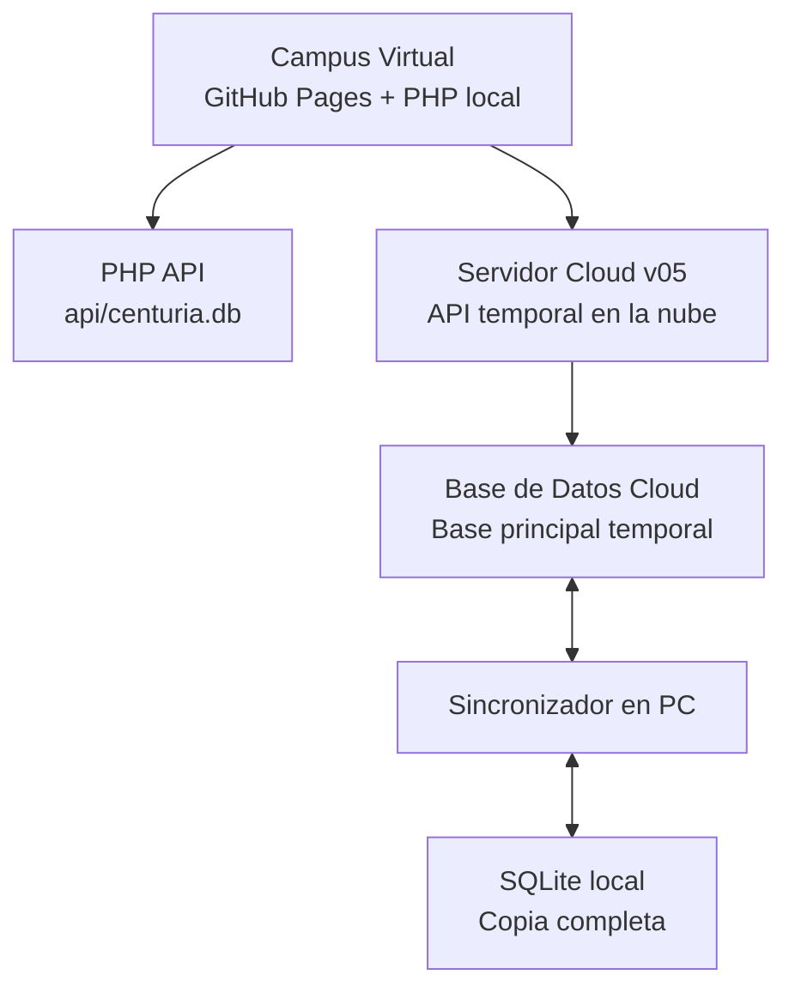

# PROMPT MAESTRO CENTURIA — Documentación Técnica v9.0

> **ÚNICO ARCHIVO FUENTE** para la arquitectura técnica del Campus Virtual Centuria.
> Contiene: arquitectura, base de datos, APIs, sincronización, usuarios, roles, estado actual y roadmap completo.

---

## 1. Arquitectura General



- **GitHub Pages** = frontend estático (HTML/JS/CSS)
- **PHP local** = backend definitivo (`XAMPP en 127.0.0.1:8080`)
- **Servidor Cloud v05** = API temporal en la nube (mientras no haya servidor PHP público)
- **Base de Datos Cloud** = base principal accesible por internet
- **SQLite** = copia completa en la PC (`api/centuria.db`)
- El frontend no debe saber si los datos provienen de servicios locales o en la nube
- La migración de GAS→PHP se hace cambiando la URL de la API en `app/js/api.js`

---

## 2. URLs Activas

### Servidor Cloud v05 (endpoint en la nube)
```
https://script.google.com/macros/s/AKfycbw-f6I2uM2U4oaU-CJihO14Lpq8P919dd3-2lkOfyt5QsDsAXf35EhCrt5yVL9v6neI/exec
```

### PHP local (XAMPP)
```
http://127.0.0.1:8080/api/
```

### Repositorios GitHub
| Repo | URL | Propósito |
|------|-----|-----------|
| CampusVirtual | `https://github.com/wmlumen/CampusVirtual` | Sistema principal (activo) |
| Asistencia | `https://github.com/wmlumen/Asistencia` | Legacy (ya no se usa) |

---

## 3. Servidor Cloud v05 — Acciones Completas

### Hojas de Base de Datos Cloud (19 tablas)

| # | Hoja | Propósito |
|---|------|-----------|
| 1 | `RegistroAlumnos` | Datos de alumnos |
| 2 | `Roles` | Asignación de roles |
| 3 | `Matriculaciones` | Formularios de matrícula |
| 4 | `FormulariosCarrera` | Plantillas de formularios |
| 5 | `FormulariosAlumno` | Respuestas de formularios |
| 6 | `AttendanceEvents` | Eventos de asistencia |
| 7 | `AttendanceRecords` | Registros de asistencia |
| 8 | `CalendarEvents` | Eventos del calendario |
| 9 | `Filiales` | Sedes/filiales |
| 10 | `Asignaturas` | Catálogo de materias |
| 11 | `Asistencias` | Asistencia legacy |
| 12 | `ProgresoUnidades` | Avance por unidad |
| 13 | `ProgresoDetalle` | Detalle de lectura |
| 14 | `Notas` | Calificaciones |
| 15 | `Pagos` | Pagos por módulo |
| 16 | `Accesos` | Log de accesos |
| 17 | `Catálogos` | Catálogos dinámicos |
| 18 | `Planificaciones` | Planificación de clases |
| 19 | `ProgresoG` | Progreso grupal |

### Acciones GET (12)

| # | Acción | Descripción |
|---|--------|-------------|
| 1 | `verificar_alumno` | Verificar si cédula existe |
| 2 | `verificar_roles` | Obtener roles de un usuario |
| 3 | `listar_cursos` | Listar cursos por rol |
| 4 | `consultar_pagos` | Consultar pagos |
| 5 | `consultar_progreso` | Consultar progreso |
| 6 | `resumen_admin` | Resumen administrativo |
| 7 | `verificar_matricula` | Verificar si tiene matrícula |
| 8 | `obtener_matricula` | Obtener mi matrícula |
| 9 | `listar_matriculas` | Listar todas (admin) |
| 10 | `detalle_matricula` | Detalle de matrícula |
| 11 | `estadisticas_matricula` | Estadísticas |
| 12 | `listar_formularios` | Listar formularios por carrera |

### Acciones GET v05 adicionales

| # | Acción | Descripción |
|---|--------|-------------|
| 13 | `obtener_formulario` | Obtener formulario por código |
| 14 | `mis_formularios` | Formularios de un alumno |
| 15 | `completitud_formularios` | Resumen de completitud |
| 16 | `listar_eventos_asistencia` | Eventos de asistencia |
| 17 | `validar_codigo_asistencia` | Validar código de 6 caracteres |
| 18 | `detalle_evento_asistencia` | Detalle de evento |
| 19 | `mis_eventos_asistencia` | Eventos de un alumno |
| 20 | `listar_eventos_calendario` | Eventos del calendario |
| 21 | `detalle_evento_calendario` | Detalle de evento |
| 22 | `verificar_conflictos_calendario` | Verificar conflictos de horario |
| 23 | `listar_filiales` | Listar filiales |
| 24 | `admins_por_filial` | Admins de una filial |
| 25 | `listar_asignaturas` | Catálogo de asignaturas |
| 26 | `resumen_asistencia_tic` | Resumen asistencia TIC |

### Acciones POST (19)

| # | Acción | Descripción |
|---|--------|-------------|
| 1 | `registrar_alumno` | Registrar alumno nuevo |
| 2 | `marcar_asistencia` | Marcar asistencia |
| 3 | `guardar_autoevaluacion` | Guardar autoevaluación |
| 4 | `guardar_clase_tic` | Guardar clase TIC |
| 5 | `justificar_ausencia_tic` | Justificar ausencia TIC |
| 6 | `guardar_pago` | Guardar pago |
| 7 | `registrar_acceso` | Registrar acceso |
| 8 | `guardar_progreso` | Guardar progreso |
| 9 | `guardar_progreso_detalle` | Guardar detalle de progreso |
| 10 | `actualizar_rol` | Actualizar rol |
| 11 | `asignar_rol` | Asignar nuevo rol |
| 12 | `registrar_matricula` | Registrar matrícula |
| 13 | `actualizar_matricula` | Actualizar matrícula |
| 14 | `cambiar_estado_matricula` | Cambiar estado de matrícula |
| 15 | `eliminar_matricula` | Eliminar matrícula |
| 16 | `guardar_formulario_alumno` | Guardar formulario completado |
| 17 | `crear_evento_asistencia` | Crear evento con código |
| 18 | `registrar_asistencia_codigo` | Registrar asistencia con código |
| 19 | `crear_evento_calendario` | Crear evento del calendario |

---

## 4. Base SQLite Local

### Ubicación
```text
api/centuria.db
```

### Tablas principales

#### users
```sql
CREATE TABLE users (
    id INTEGER PRIMARY KEY AUTOINCREMENT,
    uuid TEXT UNIQUE,
    username TEXT UNIQUE NOT NULL,
    password TEXT NOT NULL,
    firstname TEXT NOT NULL,
    lastname TEXT NOT NULL,
    email TEXT DEFAULT '',
    course_id INTEGER,
    role TEXT DEFAULT 'student',
    telefono TEXT DEFAULT '',
    grado TEXT DEFAULT '',
    carrera TEXT DEFAULT '',
    seccion TEXT DEFAULT '',
    foto TEXT DEFAULT '',
    estado TEXT DEFAULT 'activo',
    created_at DATETIME DEFAULT CURRENT_TIMESTAMP,
    updated_at DATETIME DEFAULT CURRENT_TIMESTAMP,
    deleted_at DATETIME,
    sync_version INTEGER DEFAULT 1,
    sync_status TEXT DEFAULT 'sincronizado'
);
```

#### user_roles
```sql
CREATE TABLE user_roles (
    id INTEGER PRIMARY KEY AUTOINCREMENT,
    uuid TEXT UNIQUE,
    user_id INTEGER NOT NULL,
    rol TEXT NOT NULL,
    carrera TEXT DEFAULT '',
    seccion TEXT DEFAULT '',
    asignatura TEXT DEFAULT '',
    filial TEXT DEFAULT '',
    estado TEXT DEFAULT 'activo',
    asignado_por TEXT DEFAULT '',
    created_at DATETIME DEFAULT CURRENT_TIMESTAMP,
    updated_at DATETIME DEFAULT CURRENT_TIMESTAMP,
    deleted_at DATETIME,
    sync_version INTEGER DEFAULT 1,
    sync_status TEXT DEFAULT 'sincronizado',
    FOREIGN KEY (user_id) REFERENCES users(id) ON DELETE CASCADE
);
```

#### roles_config
```sql
CREATE TABLE roles_config (
    id INTEGER PRIMARY KEY AUTOINCREMENT,
    uuid TEXT UNIQUE,
    nombre TEXT UNIQUE NOT NULL,
    descripcion TEXT DEFAULT '',
    permisos TEXT DEFAULT '{}',
    color TEXT DEFAULT '#64748b',
    icono TEXT DEFAULT 'bi-person',
    activo INTEGER DEFAULT 1,
    created_at DATETIME DEFAULT CURRENT_TIMESTAMP,
    updated_at DATETIME DEFAULT CURRENT_TIMESTAMP,
    deleted_at DATETIME,
    sync_version INTEGER DEFAULT 1,
    sync_status TEXT DEFAULT 'sincronizado'
);
```

#### usuarios_pendientes
```sql
CREATE TABLE usuarios_pendientes (
    id INTEGER PRIMARY KEY AUTOINCREMENT,
    uuid TEXT UNIQUE,
    cedula TEXT UNIQUE NOT NULL,
    nombre TEXT NOT NULL,
    apellido TEXT NOT NULL,
    email TEXT DEFAULT '',
    telefono TEXT DEFAULT '',
    grado TEXT DEFAULT '',
    carrera TEXT DEFAULT '',
    seccion TEXT DEFAULT '',
    foto TEXT DEFAULT '',
    estado TEXT DEFAULT 'pendiente',
    observaciones TEXT DEFAULT '',
    revisado_por TEXT DEFAULT '',
    created_at DATETIME DEFAULT CURRENT_TIMESTAMP,
    reviewed_at DATETIME,
    updated_at DATETIME DEFAULT CURRENT_TIMESTAMP,
    deleted_at DATETIME,
    sync_version INTEGER DEFAULT 1,
    sync_status TEXT DEFAULT 'sincronizado'
);
```

#### filiales
```sql
CREATE TABLE filiales (
    id INTEGER PRIMARY KEY AUTOINCREMENT,
    uuid TEXT UNIQUE,
    nombre TEXT UNIQUE NOT NULL,
    codigo TEXT UNIQUE NOT NULL,
    direccion TEXT DEFAULT '',
    telefono TEXT DEFAULT '',
    estado TEXT DEFAULT 'activo',
    creado_por TEXT DEFAULT '',
    created_at DATETIME DEFAULT CURRENT_TIMESTAMP,
    updated_at DATETIME DEFAULT CURRENT_TIMESTAMP,
    deleted_at DATETIME,
    sync_version INTEGER DEFAULT 1,
    sync_status TEXT DEFAULT 'sincronizado'
);
```

#### matriculaciones
```sql
CREATE TABLE matriculaciones (
    id INTEGER PRIMARY KEY AUTOINCREMENT,
    uuid TEXT UNIQUE,
    user_id INTEGER,
    codigo_formulario TEXT DEFAULT 'CEN-AS-SM-AGP005',
    legajo_numero TEXT DEFAULT '',
    fecha_inscripcion TEXT DEFAULT '',
    nombres TEXT NOT NULL,
    apellidos TEXT NOT NULL,
    cedula TEXT NOT NULL,
    lugar_nacimiento TEXT DEFAULT '',
    fecha_nacimiento TEXT DEFAULT '',
    pais TEXT DEFAULT 'ECUADOR',
    direccion TEXT DEFAULT '',
    ciudad TEXT DEFAULT '',
    departamento TEXT DEFAULT '',
    barrio_compania TEXT DEFAULT '',
    telefono_fijo TEXT DEFAULT '',
    telefono_movil TEXT DEFAULT '',
    correo_electronico TEXT DEFAULT '',
    titulo_bachiller TEXT DEFAULT '',
    institucion_origen TEXT DEFAULT '',
    ciudad_pais_estudio TEXT DEFAULT '',
    anio_promocion TEXT DEFAULT '',
    semestre TEXT DEFAULT '',
    carrera TEXT DEFAULT '',
    tipo_alumno TEXT DEFAULT 'nuevo',
    matricula_guaranies TEXT DEFAULT '',
    mensualidad TEXT DEFAULT '',
    plan_pago TEXT DEFAULT '',
    asignaturas_pendientes TEXT DEFAULT '',
    semestres_pendientes TEXT DEFAULT '',
    informacion_adicional TEXT DEFAULT '',
    acepta_declaracion INTEGER DEFAULT 0,
    firma TEXT DEFAULT '',
    estado TEXT DEFAULT 'pendiente',
    registrado_por TEXT DEFAULT '',
    observaciones TEXT DEFAULT '',
    created_at DATETIME DEFAULT CURRENT_TIMESTAMP,
    updated_at DATETIME DEFAULT CURRENT_TIMESTAMP,
    deleted_at DATETIME,
    sync_version INTEGER DEFAULT 1,
    sync_status TEXT DEFAULT 'sincronizado',
    FOREIGN KEY (user_id) REFERENCES users(id)
);
```

#### docente_asignaturas
```sql
CREATE TABLE docente_asignaturas (
    id INTEGER PRIMARY KEY AUTOINCREMENT,
    uuid TEXT UNIQUE,
    docente_cedula TEXT NOT NULL,
    asignatura TEXT NOT NULL,
    carrera TEXT DEFAULT '',
    seccion TEXT DEFAULT '',
    semestre TEXT DEFAULT '',
    estado TEXT DEFAULT 'activo',
    created_at DATETIME DEFAULT CURRENT_TIMESTAMP,
    updated_at DATETIME DEFAULT CURRENT_TIMESTAMP,
    deleted_at DATETIME,
    sync_version INTEGER DEFAULT 1,
    sync_status TEXT DEFAULT 'sincronizado'
);
```

#### asignaturas
```sql
CREATE TABLE asignaturas (
    id INTEGER PRIMARY KEY AUTOINCREMENT,
    uuid TEXT UNIQUE,
    nombre TEXT NOT NULL,
    codigo TEXT UNIQUE NOT NULL,
    carrera TEXT DEFAULT '',
    semestre INTEGER DEFAULT 1,
    carga_horaria INTEGER DEFAULT 0,
    color TEXT DEFAULT '#10b981',
    icono TEXT DEFAULT 'bi-book',
    created_at DATETIME DEFAULT CURRENT_TIMESTAMP,
    updated_at DATETIME DEFAULT CURRENT_TIMESTAMP,
    deleted_at DATETIME,
    sync_version INTEGER DEFAULT 1,
    sync_status TEXT DEFAULT 'sincronizado'
);
```

#### Otras tablas implementadas
- `courses` — Cursos
- `grades` — Calificaciones
- `attendance` — Asistencia básica
- `calendar_events` — Eventos del calendario extendido
- `attendance_events` — Eventos de asistencia con código único
- `attendance_records` — Registros de asistencia por evento
- `unit_progress` — Progreso por unidad
- `exam_questions` — Banco de preguntas (50 semillas)
- `exam_attempts` — Intentos de examen
- `formularios_carrera` — Plantillas de formularios
- `formularios_alumno` — Datos de formularios por alumno
- `documentos` — Documentos del docente

---

## 5. Sistema de Sincronización

### Copia local en PC
```text
Centuria/
├── sincronizador/
│   ├── centuria_sync.py
│   ├── config.json
│   ├── logs/
│   └── backups/
└── datos/
    └── centuria.db
```

### Frecuencia de sincronización
- Al iniciar la PC
- Cada 10-15 minutos
- Manualmente mediante botón
- Antes de cerrar el sistema
- Cuando se recupere conexión a internet

### Estados de sincronización
| Estado | Descripción |
|--------|-------------|
| `sincronizado` | Registro idéntico en ambas fuentes |
| `pendiente_subir` | Modificado localmente, pendiente de subir a la Nube |
| `pendiente_descargar` | Modificado en la Nube, pendiente de descargar local |
| `conflicto` | Modificado en ambas fuentes con valores diferentes |
| `error` | Error durante la sincronización |

---

## 6. Usuarios y Roles

### Roles del sistema
| Rol DB | Rol Español | Nivel | Acceso |
|--------|-------------|-------|--------|
| `student` | Alumno | 1 | Unidades de estudio, progreso, exámenes |
| `teacher` | Docente | 2 | Panel docente, asistencia, notas, actas |
| `academic` | Académico | 3 | Coordinación académica, indicadores |
| `admin` | Administrador | 4 | Control total del sistema |
| `administrador_plataforma` | Admin Plataforma | 4 | Configuración del sistema |
| `admin_filial` | Admin Filial | 3 | Gestión de una filial específica |

### Jerarquía de roles
```
admin (4) > academico (3) > docente (2) > alumno (1)
```

### Flujo de registro
1. Usuario se registra con cédula, nombre, apellido y contraseña
2. Se guarda en `usuarios_pendientes` (estado: pendiente)
3. Admin aprueba o rechaza
4. Al aprobar: se crea en `users` + `user_roles` con contraseña generada
5. Sync silenciosa con Base de Datos Cloud

### Flujo de login
1. Cédula → verificar si existe
2. Si no existe → mostrar "no registrado"
3. Si existe → mostrar campo contraseña
4. Contraseña → login → token
5. Obtener roles → si múltiples → selector
6. Sync silenciosa con Base de Datos Cloud

### Regla de contraseñas
```
Primera letra Nombre (Mayús) + primera letra Apellido (minús) + cédula(sin puntos) + *
```

### Usuarios de demo
| Usuario | Contraseña | Rol |
|---------|------------|-----|
| `1340130` | `Ck1340130*` | Admin |
| `1340125` | `Nk1340125*` | Docente |

### Permisos disponibles
```javascript
['ver_cursos', 'editar_cursos', 'ver_notas', 'editar_notas',
 'ver_asistencia', 'editar_asistencia', 'ver_calendario', 'editar_calendario',
 'ver_documentos', 'editar_documentos', 'gestionar_usuarios', 'gestionar_roles',
 'ver_reportes', 'ver_config']
```

---

## 7. Endpoints PHP Disponibles

### Base URL
```
http://127.0.0.1:8080/api/
```

### Autenticación
Todas las escrituras requieren `Authorization: Bearer <token>`.

### Endpoints

| Archivo | Acciones | Descripción |
|---------|----------|-------------|
| `auth.php` | login, register, validate, logout, find_user, change_password, reset_password | Autenticación |
| `usuarios.php` | list, pendientes, get, update, aprobar, rechazar, add_role, remove_role, update_role, registrar_directo, update_profile | Gestión de usuarios |
| `roles.php` | list, create, update, delete | Catálogo de roles |
| `catalogos.php` | list, create, update, delete | Catálogos académicos |
| `filiales.php` | list, create, toggle, delete, assign-admin, admins-by-filial | Filiales |
| `matriculaciones.php` | save, my, check, list, detail, update_status, stats, delete | Matrículas |
| `formularios.php` | list_forms, create, update, delete, my_forms, save_data, completions, detail, seed | Formularios por carrera |
| `docente.php` | my_subjects, list, assign, unassign | Asignación de cátedras |
| `asignaturas.php` | list, create, update, delete | Gestión de asignaturas |
| `courses.php` | CRUD completo | Cursos |
| `grades.php` | list, get, record, final | Calificaciones |
| `attendance.php` | create_event, close_event, validate_code, register, my_events, event_detail, report_general, export_csv | Asistencia con códigos |
| `calendar.php` | create, list, update, delete, conflict_check | Calendario académico |
| `progress.php` | save, get | Progreso de unidades |
| `exams.php` | create, submit, seed, questions | Exámenes dinámicos |
| `documentos.php` | get, save | Documentos del docente |
| `upload.php` | import, health | Importación CSV |
| `reports.php` | dashboard | Datos del dashboard |
| `admin.php` | various | Funciones administrativas |
| `teachers.php` | various | Gestión de docentes |
| `subjects.php` | various | Gestión de asignaturas |
| `secciones.php` | various | Gestión de secciones |
| `records.php` | various | Registros |
| `kit.php` | various | Kit de materiales |

---

## 8. Páginas y Archivos Implementados

### Páginas principales
| Archivo | Función | Rol |
|---------|---------|-----|
| `app/index.html` | Login + registro | Todos |
| `app/dashboard.html` | Panel principal adaptativo | Todos |
| `app/perfil.html` | Perfil + "Mis Formularios" | Todos |
| `app/formulario-matricula.html` | Formulario de matrícula completo | Alumnos |
| `app/calendario.html` | Calendario académico | Todos |
| `app/attendance.html` | Gestión de asistencia | Docente |
| `app/docente.html` | Panel docente | Docente |
| `app/libreta.html` | Libreta de notas | Alumno/Docente |
| `app/habilitar_asig.html` | Habilitar asignaturas | Admin |

### Páginas académicas (`app/academic/`)
| Archivo | Función | Rol |
|---------|---------|-----|
| `index.html` | Índice de contenidos | Todos |
| `asistencia_presencial.html` | Asistencia presencial con código | Alumno/Docente |
| `autoevaluacion_secuencial.html` | Autoevaluación secuencial | Alumno |
| `criterios_evaluacion.html` | Criterios de evaluación | Alumno/Docente |
| `examen_virtual_completo.html` | Examen interactivo con temporizador | Alumno |
| `examen_final_escrito.html` | Examen final escrito | Alumno |
| `examen_final_virtual.html` | Examen final virtual | Alumno |
| `examen_parcial1.html` | Parcial 1 | Alumno |
| `examen_parcial2.html` | Parcial 2 | Alumno |
| `examen_virtual.html` | Examen virtual básico | Alumno |
| `glosario.html` | Glosario de términos | Alumno |
| `indicadores_por_unidad.html` | Indicadores por unidad | Alumno/Docente |
| `justificar_ausencia.html` | Justificar ausencia con archivos | Alumno |
| `monografia.html` | Monografía | Alumno |
| `panel_docente_analytics.html` | Analytics del docente con gráficos | Docente |
| `seguimiento_asistencia.html` | Seguimiento % asistencia por alumno | Docente |

### Formatos (`app/Formatos/`)
| Archivo | Función |
|---------|---------|
| `teacher_panel.html` | Panel del docente |

### Admin (`app/admin/`)
| Archivo | Función |
|---------|---------|
| `sections/formularios.html` | Gestión de formularios (Alpine.js SPA) |
| `js/admin.js` | Lógica del admin panel |

### JavaScript (`app/js/`)
| Archivo | Función |
|---------|---------|
| `api.js` | CenturiaAPI wrapper + funciones GAS |
| `accesibilidad.js` | Panel WCAG (tamaño fuente, alto contraste) |
| `session-guard.js` | Control de timeout de sesión |
| `logout.js` | Cierre de sesión |
| `portal-layout.js` | Layout del portal |
| `view-as-admin.js` | Vista previa como admin |
| `centuria-plugins.js` | Plugins del sistema |
| `devmode.js` | Modo desarrollo |

### CSS (`app/css/`)
| Archivo | Función |
|---------|---------|
| `styles.css` | Estilos principales |
| `accesibilidad.css` | Estilos de accesibilidad |

---

## 9. Decisiones Técnicas Vigentes

| Decisión | Justificación |
|----------|---------------|
| Base de Datos Cloud como base principal temporal | Accesible por internet sin servidor PHP público |
| SQLite como copia local | Funciona sin internet, respaldo recuperable |
| PHP como backend definitivo | Solo cambiar la URL de la API |
| UUID por registro | Consistencia entre la Nube y almacenamiento local |
| `sync_version` para conflictos | Detectar quién modificó último |
| Alpine.js para interactividad | Ligero, sin build step |
| Tailwind CSS + Bootstrap 5 | Utilidades rápidas + componentes probados |
| GitHub Pages para frontend | Despliegue automático vía Actions |
| CampusVirtual es EL sistema | Asistencia es legacy, todo se migra aquí |

---

## 10. Estado de Implementación

### ✅ Implementado y funcionando

#### Core del sistema
- Autenticación con cédula y contraseña (login, registro, cambio contraseña)
- Sistema multi-roles con permisos (student, teacher, academic, admin, admin_filial)
- Panel administrativo SPA con secciones dinámicas
- Dashboards adaptativos por rol
- Perfil de usuario con edición

#### Matrícula y formularios
- Formulario de matrícula completo (35+ campos, guardado DB + Base de Datos Cloud)
- Sistema de formularios genéricos por carrera
- CRUD de plantillas de formularios
- Completitud de formularios por alumno
- Admin: vista de formularios con stats y barra de progreso

#### Asistencia
- Sistema de asistencia con códigos únicos de 6 caracteres
- Eventos de asistencia (crear, cerrar, validar código)
- Registros de asistencia por evento
- Reporte general y exportación CSV
- Seguimiento de asistencia % por alumno (nuevo)
- Justificación de ausencias con subida de archivos (nuevo)

#### Calendario
- Calendario académico con CRUD completo
- Detección de conflictos de horario
- Colores por tipo de evento

#### Evaluaciones
- Banco de 50 preguntas semillas (EIS, TIC)
- Exámenes dinámicos con intentos
- Examen virtual completo con temporizador, navegación y auto-calificación (nuevo)
- Calificaciones y planilla de avance

#### Contenido académico
- Unidades de estudio (Unidad_01 a Unidad_10)
- Glosario, criterios de evaluación, indicadores por unidad
- Autoevaluación secuencial
- Monografías

#### Panel docente
- Asignación de cátedras (docente ↔ asignatura)
- Panel docente con analytics y gráficos (nuevo)
- Asistencia presencial con códigos

#### Gestión administrativa
- Filiales con CRUD
- Catálogos dinámicos
- Gestión de usuarios (aprobar, rechazar, roles)
- Documentos del docente
- Kit de materiales

#### Accesibilidad
- Panel WCAG con controles de tamaño de fuente
- Alto contraste con persistencia en localStorage

#### Sincronización
- Funciones GAS para双向 sync (api.js)
- Matrícula sync con Base de Datos Cloud

---

### 🔴 PENDIENTE — Roadmap Completo

#### FASE 1: Estabilizar lo existente (PRIORIDAD MÁXIMA)

| # | Tarea | Estado | Dependencias | Notas |
|---|-------|--------|--------------|-------|
| 1.1 | **Cursos independientes por asignatura** | 🔴 No iniciado | Ninguna | Cada asignatura con programa, unidades, evaluaciones y progreso propio. Clave: separar contenido TIC genérico por materia real. Tabla `course_content` con: asignatura_id, unidad, seccion, tipo, titulo, contenido_html, orden, visible |
| 1.2 | **Editor de cursos para docentes** | 🔴 No iniciado | 1.1 | Interfaz visual para crear/editar contenidos sin HTML. Drag & drop de secciones, preview en vivo, publicar/borrador |
| 1.3 | **Sistema de actividades** | 🔴 No iniciado | 1.1 | Tabla `activities`: tipo (tarea, foro, encuesta, leccion), fecha_entrega, puntos_max, instrucciones |
| 1.4 | **Tareas y entregas** | 🔴 No iniciado | 1.3 | Tabla `submissions`: activity_id, user_id, archivo_url, texto_entregado, nota, retroalimentacion, fecha_entrega |
| 1.5 | **Banco de preguntas completo** | 🟡 Parcial (50 semillas) | 1.1 | Categorías por asignatura, versiones, tipos (multiple, verdadero_falso, ensayo), importación CSV, pregunta con imagen |
| 1.6 | **Exámenes seguros** | 🟡 Parcial (temporizador básico) | 1.5 | Duración configurable, intentos máximos, orden aleatorio, guardado automático cada 30s, anti-copia, pantalla completa, monitoreo de pestaña |
| 1.7 | **Libro de calificaciones** | 🟡 Parcial (grades básico) | 1.1, 1.3 | Categorías (parcial, final, tareas, participación), porcentajes configurables, promedio ponderado, exportación PDF/CSV |
| 1.8 | **Matriculación real** | 🟡 Parcial (formulario existe) | 1.1 | Legajo número automático, periodo académico, sección real, documentos adjuntos, comprobante de pago, flujo de aprobación completo |

#### FASE 2: LMS académico básico

| # | Tarea | Estado | Dependencias | Notas |
|---|-------|--------|--------------|-------|
| 2.1 | **Contenido dinámico por materia** | 🔴 No iniciado | 1.1 | Cada asignatura carga su propio programa, no contenido genérico de TIC |
| 2.2 | **Lecciones interactivas** | 🔴 No initiado | 1.3 | Contenido con video, audio, quizzes incrustados, progreso por sección |
| 2.3 | **Foros de discusión** | 🔴 No iniciado | 1.3 | Hilos de discusión por tema, respuestas, votos, marcador de leído/no leído |
| 2.4 | **Encuestas** | 🔴 No iniciado | 1.3 | Formularios con opción múltiple, escala Likert, abiertas, resultados agregados |
| 2.5 | **Notificaciones in-app** | 🔴 No iniciado | — | Sistema de notificaciones internas: nuevas tareas, calificaciones, mensajes |
| 2.6 | **Mensajería docente-alumno** | 🔴 No iniciado | — | Chat simple o mensajería interna por asignatura |

#### FASE 3: Equivalencia institucional (Moodle-equivalente)

| # | Tarea | Estado | Dependencias | Notas |
|---|-------|--------|--------------|-------|
| 3.1 | **Grupos y cohortes** | 🔴 No iniciado | 1.1 | Crear grupos de alumnos dentro de una asignatura, tareas por grupo |
| 3.2 | **Competencias** | 🔴 No iniciado | 1.7 | Rúbricas de competencias, evaluación por criterios |
| 3.3 | **Reportes avanzados** | 🔴 No iniciado | 1.7 | Reportes por asignatura, por alumno, comparativos, tendencias |
| 3.4 | **Copia/restauración de cursos** | 🔴 No iniciado | 1.1 | Exportar/importar curso completo con contenido |
| 3.5 | **Papelera y recuperación** | 🔴 No iniciado | — | Eliminación lógica con posibilidad de recuperar |
| 3.6 | **Gestor de archivos** | 🔴 No iniciado | 1.4 | Subir, organizar, compartir archivos por asignatura |
| 3.7 | **PWA y trabajo sin conexión** | 🔴 No iniciado | — | Service worker, cache de contenido, sync cuando haya red |
| 3.8 | **Calendario mejorado** | 🔴 No iniciado | — | Vista mensual, semanal, diaria, drag & drop |

#### FASE 4: Crecimiento

| # | Tarea | Estado | Dependencias | Notas |
|---|-------|--------|--------------|-------|
| 4.1 | **Planificación de clases** | 🔴 No iniciado | — | Docente crea planes semanales/mensuales con objetivos, actividades, recursos. Hoja `Planificaciones` ya existe en GAS v05 pero sin acciones |
| 4.2 | **Extensiones / plugins** | 🔴 No iniciado | — | Sistema de plugins para funcionalidad adicional |
| 4.3 | **Videoconferencia** | 🔴 No iniciado | — | Integración con Jitsi/Meet para clases en vivo |
| 4.4 | **Certificados** | 🔴 No iniciado | 1.7 | Generación de certificados de aprobación (PDF) |
| 4.5 | **Firma digital** | 🔴 No iniciado | — | Firma de documentos académicos |
| 4.6 | **Biblioteca digital** | 🔴 No iniciado | — | Repositorio de documentos, libros, enlaces |
| 4.7 | **Tesorería** | 🔴 No iniciado | — | Pagos online, facturación, estados de cuenta |
| 4.8 | **Aplicación móvil** | 🔴 No iniciado | — | PWA o app nativa |
| 4.9 | **Integraciones externas** | 🔴 No iniciado | — | APIs de terceros, SSO, LDAP |

#### TAREAS TRANSVERSALES (sin fase específica)

| # | Tarea | Estado | Descripción |
|---|-------|--------|-------------|
| T.1 | **Integrar páginas migradas en dashboard** | 🔴 Pendiente | Las 4 páginas nuevas (examen, analytics, seguimiento, justificación) existen pero no están enlazadas desde el dashboard |
| T.2 | **Migrar GAS → PHP** | 🔴 Pendiente | Cuando haya servidor PHP público, cambiar `API_GAS_URL` por `PHP_API_URL` en `api.js` |
| T.3 | **Tests automatizados** | 🔴 Pendiente | PHPUnit para APIs PHP, tests de integración |
| T.4 | **Documentación de usuario** | 🔴 Pendiente | Guías de uso para admin, docente y alumno |
| T.5 | **Optimización de rendimiento** | 🔴 Pendiente | Lazy loading de imágenes, minificación CSS/JS, cache headers |
| T.6 | **Responsive completo** | 🟡 Parcial | La mayoría funciona pero hay pages que necesitan ajuste móvil |
| T.7 | **Seguridad reforzada** | 🟡 Parcial | Rate limiting, CSRF tokens, sanitización completa |

---

## 11. Paleta de Colores Institucional

| Elemento | Color | Uso |
|----------|-------|-----|
| Fondo primario | `#007A33` | Headers, barras de navegación |
| Acento | `#00B140` | Botones, enlaces, hover |
| Tarjetas | `#ffffff` | Fondo de cards |
| Fondo cards | `#E6F4EA` | Secciones claras |
| Dorado | `#d4a843` | Logros, badges especiales |
| Texto principal | `#333` | Cuerpo |
| Texto secundario | `#666` | Labels, hints |

---

## 12. Metadata

| Campo | Valor |
|-------|-------|
| **Fecha de actualización** | 2026-09-15 |
| **Versión del sistema** | v9.0 |
| **Último commit** | `f3258a6` |
| **GAS desplegado** | v05 (31 acciones, 19 hojas) |
| **PHP endpoints** | 29 archivos, 80+ acciones |
| **Páginas implementadas** | 30+ HTML, 8 JS, 2 CSS |
| **Preguntas en banco** | 50 (semilla) |
| **Funciones completadas** | Login, roles, admin, matrícula, asistencia con código, calendario, asignaturas, exámenes dinámicos, calificaciones, sync Cloud, formularios, analytics docente, seguimiento asistencia, justificaciones, examen virtual completo, accesibilidad |
| **Funciones pendientes (Fase 1)** | Cursos independientes, editor docente, actividades, tareas, banco preguntas completo, exámenes seguros, libro calificaciones, matriculación real |
| **Funciones pendientes (Fase 2)** | Contenido dinámico, lecciones, foros, encuestas, notificaciones, mensajería |
| **Funciones pendientes (Fase 3)** | Grupos, competencias, reportes, copia cursos, papelera, archivos, PWA |
| **Funciones pendientes (Fase 4)** | Planificación, plugins, video, certificados, firma, biblioteca, tesorería, móvil, integraciones |
| **Tareas transversales** | Integrar páginas en dashboard, migrar GAS→PHP, tests, docs, optimización, responsive, seguridad |
