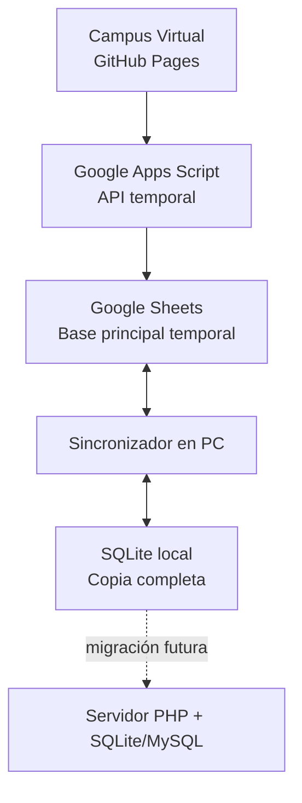

# PROMPT MAESTRO CENTURIA — Documentación Técnica v8.0

> **ÚNICO ARCHIVO FUENTE** para la arquitectura técnica del Campus Virtual Centuria.
> Contiene: arquitectura, base de datos, APIs, sincronización, usuarios, roles, y roadmap de desarrollo.

---

## 1. Arquitectura General



- Google Sheets es la base principal accesible por internet
- SQLite conserva una copia completa en la PC
- El frontend no debe saber si los datos provienen de Google, SQLite o un servidor web
- Toda funcionalidad debe estar disponible en ambas capas
- La migración futura consistirá únicamente en cambiar la dirección de la API

---

## 2. Google Apps Script

### URL del endpoint
```
https://script.google.com/macros/s/AKfycbyhfPTAVGGFsry6ueNVGQGZD0dGVbPu8zwJWnQkg6iOBcHx0FVUiAk5y8RJ1ggkIvTC2g/exec
```

### Acciones disponibles

| Acción | Método | Descripción |
|--------|--------|-------------|
| `verificar_alumno` | GET | Verificar si una cédula existe |
| `registrar_alumno` | POST | Registrar nuevo alumno |
| `marcar_asistencia` | POST | Registrar asistencia |
| `guardar_autoevaluacion` | POST | Guardar resultado de autoevaluación |
| `matricular_alumno` | POST | Guardar formulario de matrícula |

### Reglas de seguridad en Apps Script
- Contraseñas: solo hashes, nunca texto plano
- Validar permisos por acción
- Registrar cada operación administrativa en hoja `Auditoria`
- Limitar acceso a la planilla
- Configuración en `PropertiesService`, no en JavaScript público

---

## 3. Estructura de Google Sheets

| Hoja | Contenido |
|------|-----------|
| `Usuarios` | Datos personales, estado y acceso |
| `Roles` | Roles activos de cada usuario |
| `Asignaturas` | Catálogo de materias |
| `DocenteAsignaturas` | Cátedras asignadas a docentes |
| `Matriculaciones` | Formulario de matrícula |
| `MatriculaPendientes` | Asignaturas y semestres pendientes |
| `CursosSecciones` | Carreras, semestres y secciones |
| `Notas` | Calificaciones |
| `Asistencias` | Asistencia por evento |
| `Progreso` | Avance por asignatura y unidad |
| `Documentos` | Actas, planes y registros |
| `Auditoria` | Historial de acciones |
| `SyncControl` | Última sincronización y errores |

### Estructura de cada registro

Cada registro debe incluir:

| Campo | Tipo | Descripción |
|-------|------|-------------|
| `uuid` | Texto | Identificador único universal (igual en Google y SQLite) |
| `created_at` | Fecha | Fecha de creación ISO 8601 |
| `updated_at` | Fecha | Última actualización ISO 8601 |
| `deleted_at` | Fecha | Fecha de eliminación lógica (null si activo) |
| `sync_version` | Número | Versión del registro para detectar conflictos |
| `sync_status` | Texto | `sincronizado`, `pendiente_subir`, `pendiente_descargar`, `conflicto`, `error` |
| `origen` | Texto | `web`, `local`, `sheets` |

### Resolución de conflictos
1. Comparar `updated_at`
2. Comparar `sync_version`
3. Conservar ambos valores si existe duda
4. Registrar el conflicto en `Auditoria`
5. Permitir que Admin seleccione cuál conservar

---

## 4. Base SQLite Local

### Ubicación
```text
api/centuria.db
```

### Tablas principales

#### users
```sql
CREATE TABLE users (
    id INTEGER PRIMARY KEY AUTOINCREMENT,
    uuid TEXT UNIQUE,
    username TEXT UNIQUE NOT NULL,
    password TEXT NOT NULL,
    firstname TEXT NOT NULL,
    lastname TEXT NOT NULL,
    email TEXT DEFAULT '',
    course_id INTEGER,
    role TEXT DEFAULT 'student',
    telefono TEXT DEFAULT '',
    grado TEXT DEFAULT '',
    carrera TEXT DEFAULT '',
    seccion TEXT DEFAULT '',
    foto TEXT DEFAULT '',
    estado TEXT DEFAULT 'activo',
    created_at DATETIME DEFAULT CURRENT_TIMESTAMP,
    updated_at DATETIME DEFAULT CURRENT_TIMESTAMP,
    deleted_at DATETIME,
    sync_version INTEGER DEFAULT 1,
    sync_status TEXT DEFAULT 'sincronizado'
);
```

#### user_roles
```sql
CREATE TABLE user_roles (
    id INTEGER PRIMARY KEY AUTOINCREMENT,
    uuid TEXT UNIQUE,
    user_id INTEGER NOT NULL,
    rol TEXT NOT NULL,
    carrera TEXT DEFAULT '',
    seccion TEXT DEFAULT '',
    asignatura TEXT DEFAULT '',
    filial TEXT DEFAULT '',
    estado TEXT DEFAULT 'activo',
    asignado_por TEXT DEFAULT '',
    created_at DATETIME DEFAULT CURRENT_TIMESTAMP,
    updated_at DATETIME DEFAULT CURRENT_TIMESTAMP,
    deleted_at DATETIME,
    sync_version INTEGER DEFAULT 1,
    sync_status TEXT DEFAULT 'sincronizado',
    FOREIGN KEY (user_id) REFERENCES users(id) ON DELETE CASCADE
);
```

#### roles_config
```sql
CREATE TABLE roles_config (
    id INTEGER PRIMARY KEY AUTOINCREMENT,
    uuid TEXT UNIQUE,
    nombre TEXT UNIQUE NOT NULL,
    descripcion TEXT DEFAULT '',
    permisos TEXT DEFAULT '{}',
    color TEXT DEFAULT '#64748b',
    icono TEXT DEFAULT 'bi-person',
    activo INTEGER DEFAULT 1,
    created_at DATETIME DEFAULT CURRENT_TIMESTAMP,
    updated_at DATETIME DEFAULT CURRENT_TIMESTAMP,
    deleted_at DATETIME,
    sync_version INTEGER DEFAULT 1,
    sync_status TEXT DEFAULT 'sincronizado'
);
```

#### usuarios_pendientes
```sql
CREATE TABLE usuarios_pendientes (
    id INTEGER PRIMARY KEY AUTOINCREMENT,
    uuid TEXT UNIQUE,
    cedula TEXT UNIQUE NOT NULL,
    nombre TEXT NOT NULL,
    apellido TEXT NOT NULL,
    email TEXT DEFAULT '',
    telefono TEXT DEFAULT '',
    grado TEXT DEFAULT '',
    carrera TEXT DEFAULT '',
    seccion TEXT DEFAULT '',
    foto TEXT DEFAULT '',
    estado TEXT DEFAULT 'pendiente',
    observaciones TEXT DEFAULT '',
    revisado_por TEXT DEFAULT '',
    created_at DATETIME DEFAULT CURRENT_TIMESTAMP,
    reviewed_at DATETIME,
    updated_at DATETIME DEFAULT CURRENT_TIMESTAMP,
    deleted_at DATETIME,
    sync_version INTEGER DEFAULT 1,
    sync_status TEXT DEFAULT 'sincronizado'
);
```

#### filiales
```sql
CREATE TABLE filiales (
    id INTEGER PRIMARY KEY AUTOINCREMENT,
    uuid TEXT UNIQUE,
    nombre TEXT UNIQUE NOT NULL,
    codigo TEXT UNIQUE NOT NULL,
    direccion TEXT DEFAULT '',
    telefono TEXT DEFAULT '',
    estado TEXT DEFAULT 'activo',
    creado_por TEXT DEFAULT '',
    created_at DATETIME DEFAULT CURRENT_TIMESTAMP,
    updated_at DATETIME DEFAULT CURRENT_TIMESTAMP,
    deleted_at DATETIME,
    sync_version INTEGER DEFAULT 1,
    sync_status TEXT DEFAULT 'sincronizado'
);
```

#### matriculaciones
```sql
CREATE TABLE matriculaciones (
    id INTEGER PRIMARY KEY AUTOINCREMENT,
    uuid TEXT UNIQUE,
    user_id INTEGER,
    codigo_formulario TEXT DEFAULT 'CEN-AS-SM-AGP005',
    legajo_numero TEXT DEFAULT '',
    fecha_inscripcion TEXT DEFAULT '',
    nombres TEXT NOT NULL,
    apellidos TEXT NOT NULL,
    cedula TEXT NOT NULL,
    lugar_nacimiento TEXT DEFAULT '',
    fecha_nacimiento TEXT DEFAULT '',
    pais TEXT DEFAULT 'ECUADOR',
    direccion TEXT DEFAULT '',
    ciudad TEXT DEFAULT '',
    departamento TEXT DEFAULT '',
    barrio_compania TEXT DEFAULT '',
    telefono_fijo TEXT DEFAULT '',
    telefono_movil TEXT DEFAULT '',
    correo_electronico TEXT DEFAULT '',
    titulo_bachiller TEXT DEFAULT '',
    institucion_origen TEXT DEFAULT '',
    ciudad_pais_estudio TEXT DEFAULT '',
    anio_promocion TEXT DEFAULT '',
    semestre TEXT DEFAULT '',
    carrera TEXT DEFAULT '',
    tipo_alumno TEXT DEFAULT 'nuevo',
    matricula_guaranies TEXT DEFAULT '',
    mensualidad TEXT DEFAULT '',
    plan_pago TEXT DEFAULT '',
    asignaturas_pendientes TEXT DEFAULT '',
    semestres_pendientes TEXT DEFAULT '',
    informacion_adicional TEXT DEFAULT '',
    acepta_declaracion INTEGER DEFAULT 0,
    firma TEXT DEFAULT '',
    estado TEXT DEFAULT 'pendiente',
    registrado_por TEXT DEFAULT '',
    observaciones TEXT DEFAULT '',
    created_at DATETIME DEFAULT CURRENT_TIMESTAMP,
    updated_at DATETIME DEFAULT CURRENT_TIMESTAMP,
    deleted_at DATETIME,
    sync_version INTEGER DEFAULT 1,
    sync_status TEXT DEFAULT 'sincronizado',
    FOREIGN KEY (user_id) REFERENCES users(id)
);
```

#### Otras tablas
- `courses` — Cursos
- `grades` — Calificaciones
- `attendance` — Asistencia
- `calendar` — Eventos del calendario
- `documentos` — Documentos del docente
- `calendar_events` — Eventos extendidos del calendario
- `attendance_events` — Eventos de asistencia con código único
- `attendance_records` — Registros de asistencia
- `unit_progress` — Progreso por unidad
- `exam_questions` — Banco de preguntas
- `exam_attempts` — Intentos de examen
- `subject_kit` — Kit de materiales por asignatura
- `formularios_carrera` — Plantillas de formularios
- `formularios_alumno` — Datos de formularios por alumno

---

## 5. Sistema de Sincronización

### Cope local en PC
```text
Centuria/
├── sincronizador/
│   ├── centuria_sync.py
│   ├── config.json
│   ├── logs/
│   └── backups/
└── datos/
    └── centuria.db
```

### Frecuencia de sincronización
- Al iniciar la PC
- Cada 10-15 minutos
- Manualmente mediante botón
- Antes de cerrar el sistema
- Cuando se recupere conexión a internet

### Estados de sincronización
| Estado | Descripción |
|--------|-------------|
| `sincronizado` | Registro idéntico en ambas fuentes |
| `pendiente_subir` | Modificado localmente, pendiente de subir a Google |
| `pendiente_descargar` | Modificado en Google, pendiente de descargar local |
| `conflicto` | Modificado en ambas fuentes con valores diferentes |
| `error` | Error durante la sincronización |

---

## 6. Usuarios y Roles

### Roles del sistema
| Rol DB | Rol Español | Acceso |
|--------|-------------|--------|
| `student` | Alumno | Unidades de estudio, progreso |
| `teacher` | Docente | Panel docente, asistencia, notas, actas |
| `academic` | Académico | Coordinación académica, indicadores |
| `admin` | Administrador | Control total del sistema |
| `administrador_plataforma` | Admin Plataforma | Configuración del sistema |
| `admin_filial` | Admin Filial | Gestión de una filial específica |

### Jerarquía de roles
```
admin (4) > academico (3) > docente (2) > alumno (1)
```

### Flujo de registro
1. Usuario se registra con cédula, nombre, apellido y contraseña
2. Se guarda en `usuarios_pendientes` (estado: pendiente)
3. Admin aprueba o rechaza
4. Al aprobar: se crea en `users` + `user_roles` con contraseña generada
5. Sync silenciosa con Google Sheets

### Flujo de login
1. Cédula → verificar si existe
2. Si no existe → mostrar "no registrado"
3. Si existe → mostrar campo contraseña
4. Contraseña → login → token
5. Obtener roles → si múltiples → selector
6. Sync silenciosa con Google Sheets

### Regla de contraseñas
```
Primera letra Nombre (Mayús) + primera letra Apellido (minús) + cédula(sin puntos) + *
```

### Permisos disponibles
```javascript
['ver_cursos', 'editar_cursos', 'ver_notas', 'editar_notas',
 'ver_asistencia', 'editar_asistencia', 'ver_calendario', 'editar_calendario',
 'ver_documentos', 'editar_documentos', 'gestionar_usuarios', 'gestionar_roles',
 'ver_reportes', 'ver_config']
```

---

## 7. Docentes y Asignación de Cátedras

### Tabla `docente_asignaturas`
```sql
CREATE TABLE docente_asignaturas (
    id INTEGER PRIMARY KEY AUTOINCREMENT,
    uuid TEXT UNIQUE,
    docente_cedula TEXT NOT NULL,
    asignatura TEXT NOT NULL,
    carrera TEXT DEFAULT '',
    seccion TEXT DEFAULT '',
    semestre TEXT DEFAULT '',
    estado TEXT DEFAULT 'activo',
    created_at DATETIME DEFAULT CURRENT_TIMESTAMP,
    updated_at DATETIME DEFAULT CURRENT_TIMESTAMP,
    deleted_at DATETIME,
    sync_version INTEGER DEFAULT 1,
    sync_status TEXT DEFAULT 'sincronizado'
);
```

### API `docente.php`
- `my_subjects` — Asignaturas del docente autenticado
- `list` — Listar todas las asignaciones (admin)
- `assign` — Asignar cátedra (admin)
- `unassign` — Desasignar cátedra (admin)

---

## 8. Asignaturas y Unidades

### Catálogo de asignaturas
```sql
CREATE TABLE asignaturas (
    id INTEGER PRIMARY KEY AUTOINCREMENT,
    uuid TEXT UNIQUE,
    nombre TEXT NOT NULL,
    codigo TEXT UNIQUE NOT NULL,
    carrera TEXT DEFAULT '',
    semestre INTEGER DEFAULT 1,
    carga_horaria INTEGER DEFAULT 0,
    color TEXT DEFAULT '#10b981',
    icono TEXT DEFAULT 'bi-book',
    created_at DATETIME DEFAULT CURRENT_TIMESTAMP,
    updated_at DATETIME DEFAULT CURRENT_TIMESTAMP,
    deleted_at DATETIME,
    sync_version INTEGER DEFAULT 1,
    sync_status TEXT DEFAULT 'sincronizado'
);
```

### Unidades por asignatura
Cada asignatura tiene 10 unidades con:
- Programa de estudios
- Contenido por unidad (HTML)
- Recursos y materiales
- Actividades
- Evaluaciones
- Banco de preguntas propio

### Progreso por unidad
```sql
CREATE TABLE unit_progress (
    id INTEGER PRIMARY KEY AUTOINCREMENT,
    uuid TEXT UNIQUE,
    user_id INTEGER NOT NULL,
    unidad INTEGER NOT NULL,
    secciones_leidas TEXT DEFAULT '[]',
    total_secciones INTEGER DEFAULT 10,
    completada INTEGER DEFAULT 0,
    asistencia INTEGER DEFAULT 0,
    created_at DATETIME DEFAULT CURRENT_TIMESTAMP,
    updated_at DATETIME DEFAULT CURRENT_TIMESTAMP,
    deleted_at DATETIME,
    sync_version INTEGER DEFAULT 1,
    sync_status TEXT DEFAULT 'sincronizado',
    FOREIGN KEY (user_id) REFERENCES users(id),
    UNIQUE(user_id, unidad)
);
```

---

## 9. Evaluaciones, Notas y Asistencia

### Banco de preguntas
```sql
CREATE TABLE exam_questions (
    id INTEGER PRIMARY KEY AUTOINCREMENT,
    uuid TEXT UNIQUE,
    unidad INTEGER NOT NULL,
    indicador TEXT DEFAULT '',
    pregunta TEXT NOT NULL,
    opcion_a TEXT NOT NULL,
    opcion_b TEXT NOT NULL,
    opcion_c TEXT NOT NULL,
    opcion_d TEXT NOT NULL,
    respuesta INTEGER NOT NULL,
    tipo TEXT DEFAULT 'multiple',
    dificultad TEXT DEFAULT 'media',
    activa INTEGER DEFAULT 1,
    created_at DATETIME DEFAULT CURRENT_TIMESTAMP,
    updated_at DATETIME DEFAULT CURRENT_TIMESTAMP,
    deleted_at DATETIME,
    sync_version INTEGER DEFAULT 1,
    sync_status TEXT DEFAULT 'sincronizado'
);
```

### Intentos de examen
```sql
CREATE TABLE exam_attempts (
    id INTEGER PRIMARY KEY AUTOINCREMENT,
    uuid TEXT UNIQUE,
    user_id INTEGER NOT NULL,
    examen TEXT NOT NULL,
    puntuacion INTEGER DEFAULT 0,
    total_preguntas INTEGER DEFAULT 0,
    respuestas TEXT DEFAULT '{}',
    completado INTEGER DEFAULT 0,
    created_at DATETIME DEFAULT CURRENT_TIMESTAMP,
    updated_at DATETIME DEFAULT CURRENT_TIMESTAMP,
    deleted_at DATETIME,
    sync_version INTEGER DEFAULT 1,
    sync_status TEXT DEFAULT 'sincronizado',
    FOREIGN KEY (user_id) REFERENCES users(id)
);
```

### Calificaciones
```sql
CREATE TABLE grades (
    id INTEGER PRIMARY KEY AUTOINCREMENT,
    uuid TEXT UNIQUE,
    user_id INTEGER NOT NULL,
    course_id INTEGER NOT NULL,
    component VARCHAR(100) NOT NULL,
    score REAL DEFAULT 0,
    max_score REAL DEFAULT 100,
    created_at DATETIME DEFAULT CURRENT_TIMESTAMP,
    updated_at DATETIME DEFAULT CURRENT_TIMESTAMP,
    deleted_at DATETIME,
    sync_version INTEGER DEFAULT 1,
    sync_status TEXT DEFAULT 'sincronizado',
    FOREIGN KEY (user_id) REFERENCES users(id),
    FOREIGN KEY (course_id) REFERENCES courses(id)
);
```

### Escala de calificaciones
| Nota | Porcentaje | Descripción |
|------|-----------|-------------|
| 1 | 0-69% | Reprobado |
| 2 | 70-77% | Aprobado |
| 3 | 78-85% | Bueno |
| 4 | 86-93% | Muy bueno |
| 5 | 94-100% | Excelente |

### Asistencia
```sql
CREATE TABLE attendance (
    id INTEGER PRIMARY KEY AUTOINCREMENT,
    uuid TEXT UNIQUE,
    user_id INTEGER NOT NULL,
    course_id INTEGER NOT NULL,
    date DATE NOT NULL,
    status TEXT DEFAULT 'present',
    created_at DATETIME DEFAULT CURRENT_TIMESTAMP,
    updated_at DATETIME DEFAULT CURRENT_TIMESTAMP,
    deleted_at DATETIME,
    sync_version INTEGER DEFAULT 1,
    sync_status TEXT DEFAULT 'sincronizado',
    FOREIGN KEY (user_id) REFERENCES users(id),
    FOREIGN KEY (course_id) REFERENCES courses(id),
    UNIQUE(user_id, course_id, date)
);
```

---

## 10. Formulario de Matrícula

### Variables del formulario
| Sección | Variables |
|---------|-----------|
| Control | `codigo_formulario`, `legajo_numero`, `fecha_inscripcion` |
| Identificación | `nombres`, `apellidos`, `cedula` |
| Nacimiento | `lugar_nacimiento`, `fecha_nacimiento`, `pais` |
| Domicilio | `direccion`, `ciudad`, `departamento`, `barrio_compania` |
| Contacto | `telefono_fijo`, `telefono_movil`, `correo_electronico` |
| Estudios | `titulo_bachiller`, `institucion_origen`, `ciudad_pais_estudio`, `anio_promocion` |
| Matrícula | `semestre`, `carrera`, `tipo_alumno` |
| Pagos | `matricula_guaranies`, `mensualidad`, `plan_pago` |
| Académico | `asignaturas_pendientes`, `semestres_pendientes` |
| Adicional | `informacion_adicional` |
| Validación | `acepta_declaracion`, `firma`, `estado`, `registrado_por` |

### API `matriculaciones.php`
| Acción | Método | Descripción | Auth |
|--------|--------|-------------|------|
| `save` | POST | Guardar matrícula (upsert) | Sí |
| `my` | GET | Obtener mi matrícula | Sí |
| `check` | GET | Verificar si existe matrícula | Sí |
| `list` | GET | Listar todas (admin) | Admin |
| `detail` | GET | Detalle por ID o cédula | Admin |
| `update_status` | POST | Cambiar estado | Admin |
| `stats` | GET | Estadísticas | Admin |
| `delete` | POST | Eliminar | Admin |

---

## 11. Endpoints Disponibles

### Base URL
```
http://127.0.0.1:8080/api/
```

### Autenticación
Todas las escrituras requieren `Authorization: Bearer <token>`.

### Endpoints

| Archivo | Acciones | Descripción |
|---------|----------|-------------|
| `auth.php` | login, register, validate, logout, find_user, change_password, reset_password | Autenticación |
| `usuarios.php` | list, pendientes, get, update, aprobar, rechazar, add_role, remove_role, update_role, registrar_directo, update_profile | Gestión de usuarios |
| `roles.php` | list, create, update, delete | Catálogo de roles |
| `catalogos.php` | list, create, update, delete | Catálogos académicos |
| `filiales.php` | list, create, toggle, delete, assign-admin, admins-by-filial | Filiales |
| `matriculaciones.php` | save, my, check, list, detail, update_status, stats, delete | Matrículas |
| `formularios.php` | list_forms, create, update, delete, my_forms, save_data, completions, detail, seed | Formularios por carrera |
| `docente.php` | my_subjects, list, assign, unassign | Asignación de cátedras |
| `asignaturas.php` | list, create, update, delete | Gestión de asignaturas |
| `courses.php` | CRUD completo | Cursos |
| `grades.php` | list, get, record, final | Calificaciones |
| `attendance.php` | list, mark, summary | Asistencia |
| `calendar.php` | CRUD completo | Eventos del calendario |
| `calendar.php` (extendido) | create, list, update, delete, conflict_check | Calendario académico |
| `attendance.php` (extendido) | create_event, close_event, validate_code, register, my_events, event_detail, report_general, export_csv | Asistencia con códigos |
| `progress.php` | save, get | Progreso de unidades |
| `exams.php` | create, submit, seed, questions | Exámenes dinámicos |
| `documentos.php` | get, save | Documentos del docente |
| `upload.php` | import, health | Importación CSV |
| `reports.php` | dashboard | Datos del dashboard |

---

## 12. Seguridad y Permisos

### Autenticación
- Tokens de sesión con vencimiento de 1 hora
- Validación en cada endpoint protegido
- Logout destruye el token

### Permisos por operación
- Lectura: cualquier usuario autenticado
- Escritura: según permisos del rol
- Eliminación: solo admin
- Gestión de roles: solo admin

### Protecciones necesarias
- Contraseñas: hash bcrypt, nunca texto plano
- Sesiones: expiración automática
- CSRF: tokens en formularios
- Validación: sanitizar todas las entradas
- Archivos: validar extensiones y tamaño
- Rate limiting: protección contra intentos repetidos
- Auditoría: registrar cada operación sensible

---

## 13. Convenciones de Nombres

### Archivos HTML
- `Unidad_01.html`, `Unidad_02.html`, ... `Unidad_10.html`
- `programa.html`, `planilla.html`, `glosario.html`
- `asistencia_presencial.html`, `autoevaluacion_secuencial.html`

### Archivos PHP
- `auth.php`, `usuarios.php`, `roles.php`, `catalogos.php`
- `matriculaciones.php`, `formularios.php`
- `docente.php`, `asignaturas.php`

### Tablas SQLite
- snake_case: `users`, `user_roles`, `roles_config`
- Prefijo `exam_` para exámenes
- Prefijo `attendance_` para asistencia

### Campos de sincronización
- `uuid` — Identificador único universal
- `created_at` — Fecha de creación
- `updated_at` — Última actualización
- `deleted_at` — Eliminación lógica
- `sync_version` — Versión para conflictos
- `sync_status` — Estado de sincronización

---

## 14. Estado de Implementación

### Implementado
- Autenticación con cédula y contraseña
- Sistema multi-roles con permisos
- Panel administrativo SPA
- Dashboards adaptativos por rol
- Formulario de matrícula con guardado
- Sistema de asistencia con códigos únicos
- Calendario académico con conflictos
- Gestión de asignaturas y docentes
- Banco de preguntas y exámenes
- Calificaciones y planilla de avance
- Sincronización con Google Sheets
- Filiales y catálogos dinámicos

### Pendiente (Roadmap)

#### Fase 1: Estabilizar lo existente
1. **Cursos independientes** — Cada asignatura con programa, unidades, evaluaciones y progreso propio
2. **Editor de cursos para docentes** — Crear, ordenar, publicar contenidos sin editar HTML
3. **Sistema de actividades** — Tareas, entregas, foros, encuestas, lecciones
4. **Tareas y entregas** — Tablas de actividades, entregas, retroalimentación
5. **Banco de preguntas completo** — Categorías, versiones, tipos múltiples, importación
6. **Exámenes seguros** — Duración, intentos, orden aleatorio, guardado automático
7. **Libro de calificaciones** — Dinámico, con categorías, porcentajes, exportación
8. **Matriculación real** — Legajo, periodo, sección, documentos, comprobante

#### Fase 2: LMS académico básico
- Cursos dinámicos con editor
- Matriculaciones y grupos
- Tareas y entregas
- Banco de preguntas completo
- Exámenes configurables
- Libro de calificaciones
- Notificaciones

#### Fase 3: Equivalencia institucional
- Foros y mensajería
- Grupos y cohortes
- Competencias
- Reportes avanzados
- Copia/restauración de cursos
- Papelera y recuperación
- Gestor de archivos
- PWA y trabajo sin conexión

#### Fase 4: Crecimiento
- Extensiones
- Videoconferencia
- Certificados
- Firma digital
- Biblioteca
- Tesorería
- Aplicación móvil
- Integraciones externas

---

## 15. Decisiones Técnicas Vigentes

| Decisión | Justificación |
|----------|---------------|
| Google Sheets como base principal temporal | Accesible por internet sin servidor PHP |
| SQLite como copia local | Funciona sin internet, respaldo recuperable |
| UUID por registro | Consistencia entre Google y SQLite |
| `sync_version` para conflictos | Detectar quién modificó último |
| PHP como backend definitivo | Requiere solo cambiar la URL de la API |
| Alpine.js para interactividad | Ligero, sin build step |
| Tailwind CSS + Bootstrap 5 | Utilidades rápidas + componentes probados |
| GitHub Pages para frontend | Despliegue automático vía Actions |

---

## 16. Metadata

| Campo | Valor |
|-------|-------|
| **Fecha de actualización** | 2026-09-15 |
| **Versión del sistema** | v8.0 |
| **Último commit revisado** | `c33557b` |
| **Funciones implementadas** | Login, roles, admin, matrícula, asistencia, calendario, asignaturas, exámenes, calificaciones, sync Google |
| **Funciones pendientes** | Cursos independientes, editor docente, actividades, tareas, banco preguntas, exámenes seguros, libro calificaciones, matriculación completa |
| **Decisiones técnicas vigentes** | Google Sheets temporal, SQLite local, UUID por registro, sync bidireccional, PHP como destino final |
